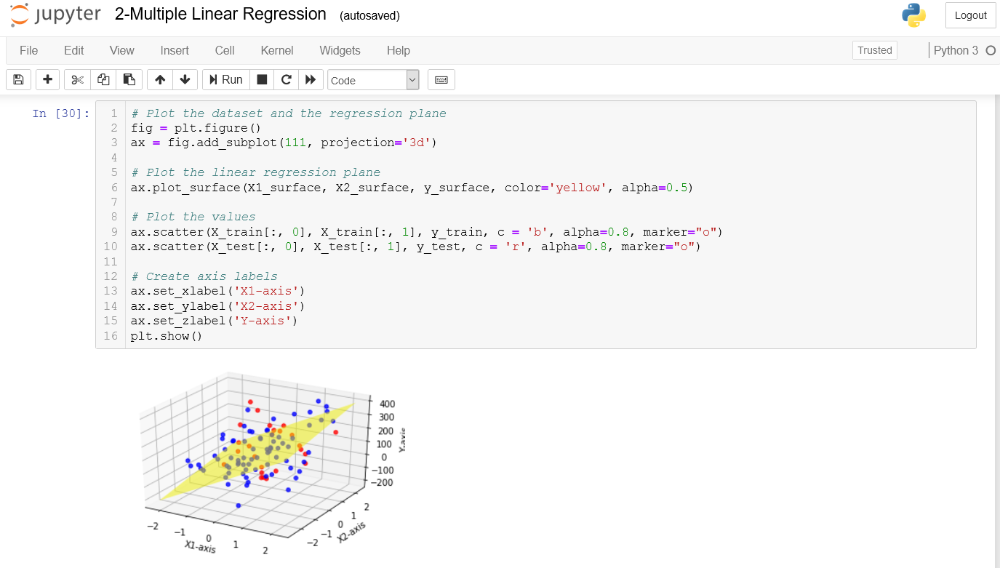
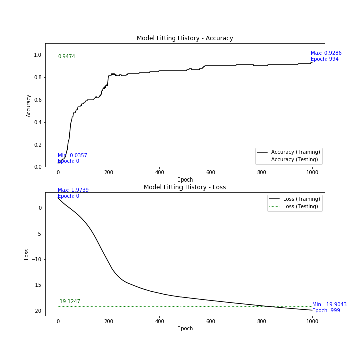

# Machine Learning Notes
This repository contains selected notes and code snippets for Machine Learning (supervised, unsupervised) that I have created or collected and enhanced.

# Technologies Used

* Python, Jupyter Notebook
* Machine Learning, Sci-Kit Learn
    * Dataset Generation
    * Regression
    * Classification
* Matplotlib

# Reference

* GitHub: https://github.com/daddyjab/ML_Notes
* Jupyter Notebooks:
    * 1-Dataset Generation and Basic Linear Regression: 
    https://github.com/daddyjab/ML_Notes/blob/master/1-Dataset%20Generation%20and%20Basic%20Linear%20Regression.ipynb 

    * 2-Multiple Linear Regression: 
    https://github.com/daddyjab/ML_Notes/blob/master/2-Multiple%20Linear%20Regression.ipynb

    * 3-Encoding Categorical Data, Scaling, and Normalization: 
    https://github.com/daddyjab/ML_Notes/blob/master/4-Linear%20Models%20for%20Regression-LinearRegression%2C%20Lasso%2C%20Ridge%2C%20ElasticNet.ipynb 

    * 4-Linear Models for Regression-LinearRegression, Lasso, Ridge, ElasticNet: 
    https://github.com/daddyjab/ML_Notes/blob/master/4-Linear%20Models%20for%20Regression-LinearRegression%2C%20Lasso%2C%20Ridge%2C%20ElasticNet.ipynb 

    * 5-Linear Models for Classification-Logistic Regression: 
    https://github.com/daddyjab/ML_Notes/blob/master/5-Linear%20Models%20for%20Classification-Logistic%20Regression.ipynb 
    
    * 6-Decision Trees: 
    https://github.com/daddyjab/ML_Notes/blob/master/6-Decision%20Trees.ipynb

# Visualizations

| Figure: 1-Dataset Generation and Basic Linear Regression - Jupyter Notebook |
|----------|
|  |

| Figure: 2-Multiple Linear Regression - Jupyter Notebook |
|----------|
|  |
|  |

| Figure: 3-Encoding Categorical Data, Scaling, and Normalization - Jupyter Notebook |
|----------|
|  |
|  |

| Figure: 4-Linear Models for Regression-LinearRegression, Lasso, Ridge, ElasticNet - Jupyter Notebook |
|----------|
|  |
|  |
|  |

| Figure: 5-Linear Models for Classification-Logistic Regression - Jupyter Notebook |
|----------|
|  |
|  |

| Figure: 6-Linear Models for Classification-Decision Trees - Jupyter Notebook |
|----------|
|  |
|  |

| Figure: 7-Cross Validation - Jupyter Notebook |
|----------|
|  |
|  |
|  |

| Figure: 8-Hyperparameter Tuning - Jupyter Notebook |
|----------|
|  |
| ") |
|  |
|  |

| Figure: 9-Neural Networks - Jupyter Notebook |
|----------|
|  |

| Figure: 10-Figure-Handwriting Recognition - Jupyter Notebook |
|----------|
|  |
